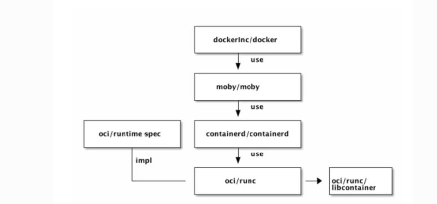
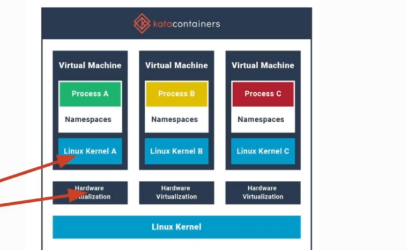
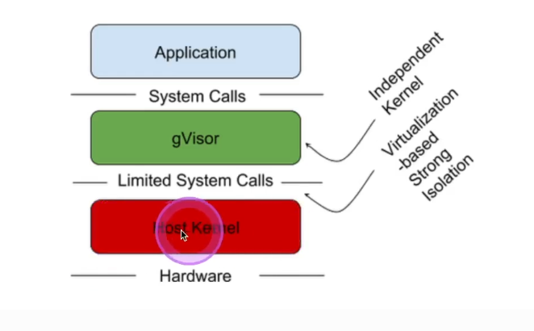

## Container run time sandboxes
- Applications and Kuberneres are only as secrure as the container runtime is secure 
- Containers  
A process in a container is simply running on the same Linux kernel adn it can communicate directly with th Linux kernel as any other process.  
Containers are separated by Kernerl Group.But the process are all run on the same Linux Kernel and they can communicate with the same kernel.
If one process manages to break out of it's container og it's kernerl group and manages to acess kernel directly, then it could acess all other running process through the kernel.
## OCI - Open Container Initiative
- Linux Foundation pproject to design open standards for virtualization
- **Specification**
  - runtime,image,distribution
- Runtime
  - runc(container runtime that imploments their specification)
- WorkFlow

- Kubernetes runtimes and CRI(Container Runtime Interface)

## Kata Containers
- Additional isolation with a lightweight VM and individual kernels.

- Strong speration layer
- Runs every container in its own private VM(Hyperivisor based)
- QEMU as default
  - (needs virtualisation,like nested virtualisation in cloud)
## gVisor - from Google
- User-space kernerl for containers  
Another layer of separation  
Not hypervisor/VM based  
Simulates kernel syscallc with limited functionality  
Runs in userspace separated from linux kernel  
Runtime called runsc
- Architecture

- RuntimeClasses
```yaml
apiVersion: node.k8s.io/v1
kind: RuntimeClass
metadata:
  name: gvisor 
handler: runsc 
```
Usage
```yaml
apiVersion: v1
kind: Pod
metadata:
  name: mypod
spec:
  runtimeClassName: gvisor
```
## Installation of gvisor/runsc with containerd

Confirm kernel version of Container
```console
kubectl exec -it gvisor -- sh uname -r
```
Confirm kernel version of Node
```console
kubectl get node -o wide
```
Confire gvisor is runngin 
```console
kubectl exec -it gvisor --sh
# dmesg
```


  