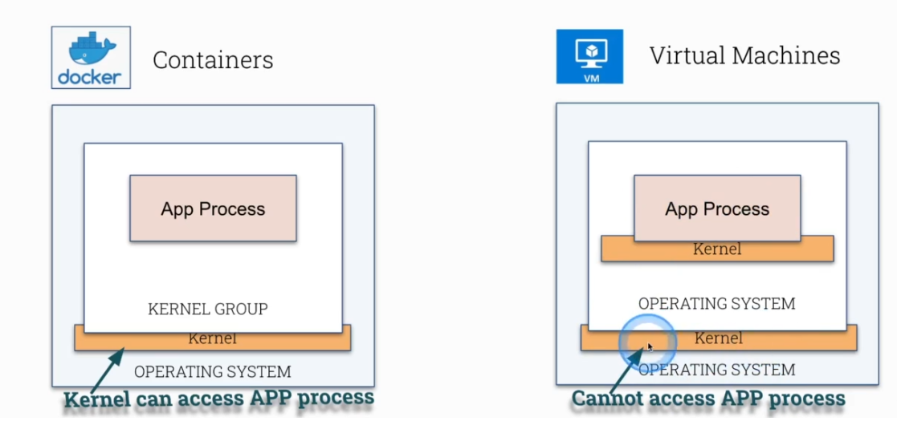

## Containers and Docker



## Reduce Image Footprint
- Look at an external Golang Dockerfile and reduce the image footprint via Muti-Stage Build
   - Build image and Run
```concole
docker build -t app .
docker run app
```
  
Only the last Stage can be saved

## Secure and hardening Images
- Use Specific package versions
- Don't run as root
- Make filesystem read only
- Remove shell access


## Best Practices for writing Dockerfiles
- https://docs.docker.com/develop/develop-images/dockerfile_best-practices/