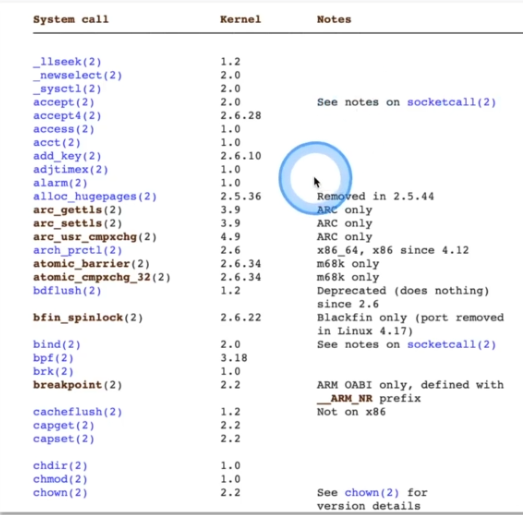

## Kernel vs User Space


 ## System Calls / Syscalls

## strace
- Intercepts and logs system calls made by process
- Log and display signals received by a process
- Diagnostic,Learning,Debugging

## strace: show syscalls

```console
strace ls /
```

## /proc directory
- Information and connections to processes and kernel
- Study it to learn how processes work
- COnfiguration and administrative tasks
- Containes files that don't exist,yet you can access these

## strace Kubernetes ETCD
- List syscalls
   - find pid
```console
docker ps | grep etcd
```
- Find open files
```concole
cat /proc/pid
ls -lh exe
cd fd
l
ls -lh
```
- Read secret value
```console
tail -f 7
cat 7 | strings | grep -A20 -B20
```

## /proc access env varibles
- Create Apache pod with a secret as envirment variable
   - Read tha secret form host filesystem
   - Secretes as environment variables can be read form anyone who can access /proc on the host
```console
pstree -p
```


## Falco
- Cloud-Native runtime security(CNCF)
- ACCESS
   - Deep kernel tracing built on the Linux kernel
- Assert
   - Describe security rules against a system(+default ones)
   - Detect unwanted behavior
- Acction
   - Automated respond to a security violations

## Install Falco
```concole
# install falco
curl -s https://falco.org/repo/falcosecurity-3672BA8F.asc | apt-key add -
echo "deb https://download.falco.org/packages/deb stable main" | tee -a /etc/apt/sources.list.d/falcosecurity.list
apt-get update -y
apt-get -y install linux-headers-$(uname -r)
apt-get install -y falco=0.26.1

# docs about falco
https://v1-16.docs.kubernetes.io/docs/tasks/debug-application-cluster/falco
```
## Falco - find malicious processes


## Falco - Change Rules
- Change Falco rule to get custom output format
```concosle
service falco status
```


